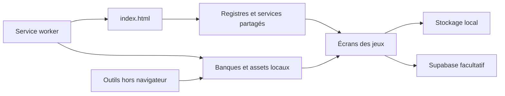

# Jeu du Duc

Jeu mobile local, servi comme **site statique HTML/CSS/JavaScript**, installable
en PWA. Le navigateur exécute les jeux ; Supabase fournit les comptes, avatars
et statistiques facultatifs. Il n'y a ni serveur applicatif à démarrer, ni
compilation pour publier le jeu.

Site : https://francoisharan.github.io/Jeu-du-duc/

## Démarrer

Depuis la racine du dépôt, avec Python 3.11+ :

```sh
python3 -m http.server 8000
```

Ouvrir `http://localhost:8000/`. HTTP sur localhost permet de tester le worker.
Ouvrir directement `index.html` avec `file://` ne permet pas de vérifier la PWA.
Le site publié fonctionne aussi sous le préfixe `/Jeu-du-duc/`.

## Organisation

| Emplacement | Responsabilité |
| --- | --- |
| `index.html` | DOM commun, écrans et ordre des scripts classiques `defer` |
| `scripts/core/` | Moteurs, registres, persistance et services partagés |
| `scripts/app/` | Écrans, interactions, comptes et éditeur de joueurs |
| `scripts/pwa.js`, `service-worker.js`, `manifest.webmanifest` | Installation, mises à jour et secours hors connexion |
| `data/` | Banques originales, métadonnées et données géographiques préparées |
| `styles/`, `image/`, `fonts/` | Apparence, visuels publics, polices et licences |
| `vendor/` | Distributions locales approuvées et licences ; ne pas reformater |
| `supabase/migrations/`, `supabase/templates/` | SQL versionné et modèles d'emails |
| `tools/imports/`, `tools/geography/` | Préparation des contenus hors navigateur |
| `tools/cloud/` | Client Node et contrôle Supabase en lecture seule |
| `tools/maintenance/` | Contrôles du dépôt et exécution de toutes les suites |
| `tests/unit/`, `tests/browser/`, `tests/fixtures/` | Moteurs, parcours Chromium, API simulée et contrats de référence |
| `docs/` | Architecture, maintenance, règles et procédures actuelles |
| `archive/` | Prototype inactif conservé, sans chargement ni précache |

Les dossiers publics existants restent en place pour préserver les installations
et leurs URLs. Le classement par fonctionnalité repose sur les noms des modules
et la [carte de l'architecture](docs/architecture.md), plutôt que sur un déplacement
risqué de leurs fichiers publics.



## Vérifier le projet

Node 24.5+ sert uniquement aux outils et aux tests. Les versions existantes des
SDK navigateur et Node restent identiques ; aucun paquet npm n'est demandé par
le site au moment de jouer.

```sh
npm ci
python3 -m pip install -r requirements-test.txt
# Installer Chromium système, ou définir PWA_TEST_CHROMIUM vers son exécutable.
npm run check
npm test
```

`npm test` exécute chaque suite dans un processus séparé et rapporte tous les
échecs. Les tests SQL utilisent PGlite local ; les tests comptes utilisent le SDK
officiel avec une API simulée, sans email ou écriture sur Supabase réel. Les
rapports et captures vont dans `/tmp`, pas dans le dépôt.

```sh
npm run test:unit
npm run test:browser
npm run format:check
python3 -m pip install -r requirements-tools.txt
npm run format:python:check
```

Pour l'outillage cloud, consulter la [configuration et la maintenance](docs/maintenance.md).
`scripts/supabase-config.js` contient uniquement la configuration **publique** du
navigateur. Aucun secret privilégié ne doit entrer dans le dépôt ou le client.

## Documentation

- [Architecture et contrats de compatibilité](docs/architecture.md)
- [Maintenance, tests, imports, formatage et publication](docs/maintenance.md)
- [Audit et décisions de remise à plat](docs/audit-2026-10-08.md)
- [PWA, installation et hors connexion](docs/operations/pwa.md)
- [Comptes, statistiques, droits et procédures Supabase](docs/backend/supabase.md)
- [Culture G., Quiz360 et Drapeaux](docs/data/culture-imports.md)
- [Cartes de soirée et imports Picolo](docs/games/party.md)
- [Devine Tête](docs/games/heads-up.md), [Géographie](docs/games/geography.md), [Grand Quiz Foot](docs/games/football.md)
- [Duel Foot](docs/games/duel-football.md), [Échecs](docs/games/chess.md)
- [Visuels et retours de jeu](docs/design/visuals.md)
- [Archives](archive/README.md)

Les instructions permanentes du propriétaire restent dans [AGENTS.md](AGENTS.md).
